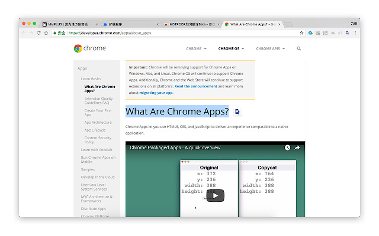

# HOTPOOR划词翻译 - 夏力维
适用于Chrome的划词翻译工具，由HOTPOOR团队开发。

## 安装使用
通过Chrome浏览器【设置】->【更多工具】->【扩展程序】->【加载已解压的扩展程序】

## DEMO效果
 

划词时的小按钮

 

点击小按钮后的展开翻译内容

## 团队介绍：
夏力维 全栈工程师 (+86)15201950688

## 使用到的技术
Chrome插件技术，contentscript方案。
