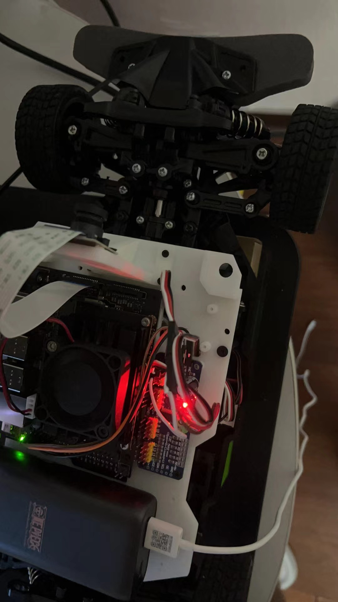
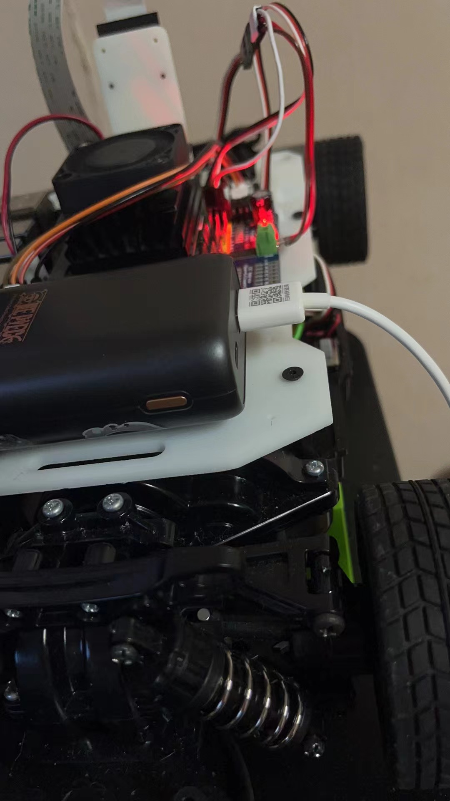

## ROS 智能物流小车

本车可以用在物流行业，比如在无人监管的情形下自动运输
它可以帮助人类完成运输任务，减少出错概率，使运输更安全
我使用了google的tensorflow作为自动驾驶的模型训练工具

## 团队

姜亚洲 微信:spacedude888

## 谷歌技术

我使用了tensorflow来自动驾驶模型，用车载摄像头读取照片，然后输入到一个CNN网络里面，用油门和转向的值来做label

## 编译

可以使用python3编译代码，请装好open CV,tensorflow,cuda-10.2

训练代码请参考training/training.py

Data collection 代码请看ai_racer/engine.py

整体框架是基于ROS2开发，如果对ROS2比较熟悉可以尝试导入整个package