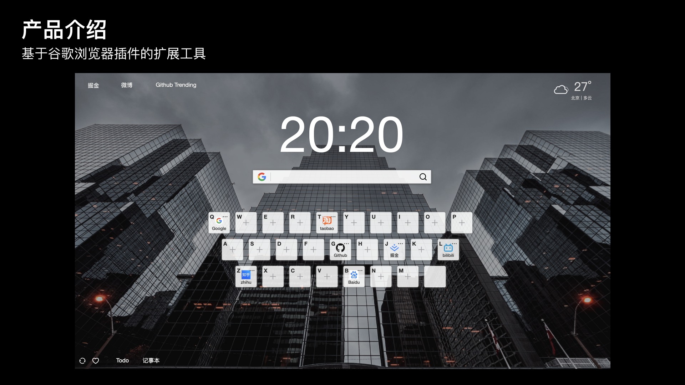
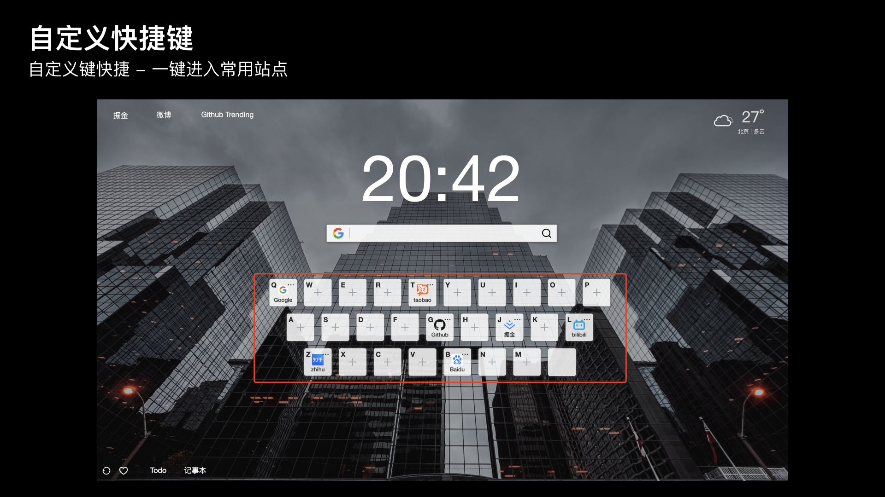
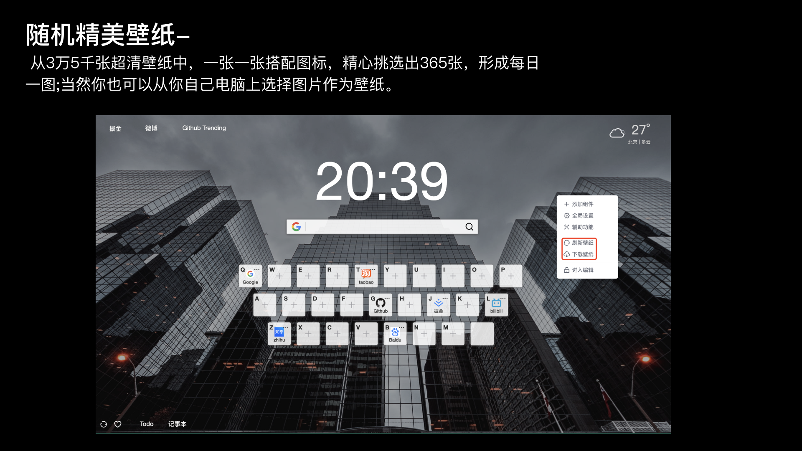
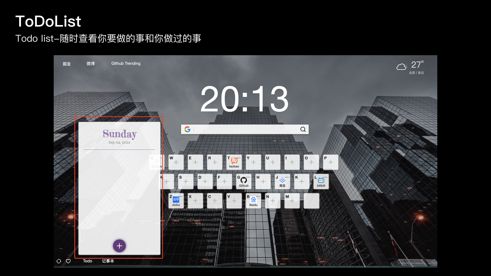

# SuperBookMark
> SuperBookMark 
基于技术 `Vue3`, `Typescript`, `Vite`等 Google Chrome 插件开发技术

## 安装、编译指南-快速开始
> 推荐用pnpm
```bash
npm install -g pnpm

pnpm install

pnpm run dev

pnpm run build:crx

```

## Google 技术
Google Chrome 插件：基于技术 `Vue3`, `Typescript`, `Vite`等 Google Chrome 插件开发技术


## 团队介绍：
### 团队成员 
- 蔡俊锋：腾讯8年全栈开发工程师，荣获 腾讯第一届云开发大赛一等奖 ，全国职业技能大赛物联网应用技术 二等奖，国家奖学金等。
- 田家明：毕业于悉尼大学MIT&MITM 负责产品功能设计
- 张岩平：UI 设计师
### 联系方式
- 微信/手机：18316541022 

## 作品背景


## 整体作品操作介绍


## 作品介绍
### 首页


### 26个字母的网站 onekey 自定义快捷键操作


### 随机精美壁纸-


### ToDoList


### 笔记


### 多个搜索引擎快速切换


## 随机图片地址 unsplash
https://source.unsplash.com/1920x1080/?nature,water,art

## Todo

1. 已开发功能
   1. - [x] 浏览器引擎Tab切换
   2. - [x] 26个字母的网站 onekey 快捷键操作
   3. - [x] 随机精美壁纸
   4. - [x] ToDoList
   5. - [x] 笔记
   6. - [x] 多个搜索引擎快速切换
2. 待开发功能
   1. - [ ] 云端同步配置
