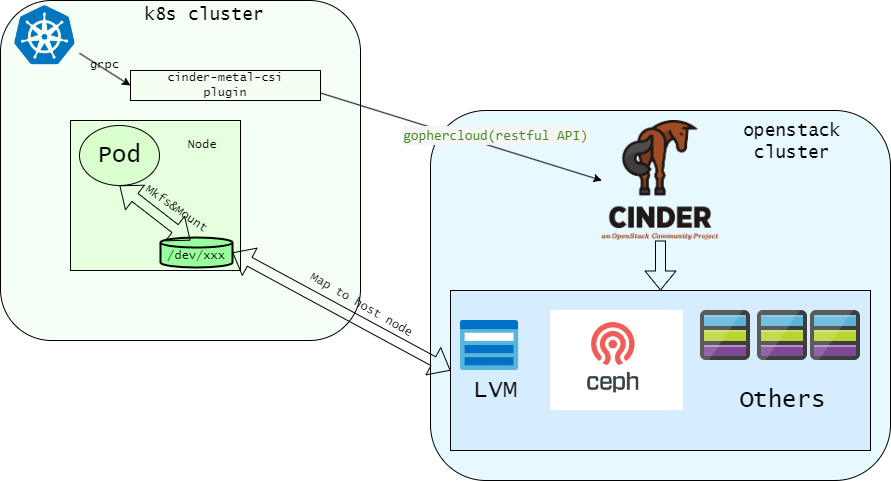

# cinder-metal-csi

[](https://github.com/kungze/cinder-metal-csi/actions/workflows/build.yaml)
[](https://github.com/kungze/cinder-metal-csi/blob/main/LICENSE)

* One CSI plugin provision multiple storage backends for kubernetes cluster.
* Make the most popular Paas platform (aka "kubernetes") use the storage service of the most popular IaaS platform (ake "openstack") become more easy and more flexible.

## Overview

The main difference with [cinder-csi-plugin](https://github.com/kubernetes/cloud-provider-openstack/blob/master/docs/cinder-csi-plugin/using-cinder-csi-plugin.md) is that the `cinder-metal-csi` plugin don't depend
nova metadata service, it can run on baremetal environment. It fill the gap that the kubernetes cluster and
openstack cluster is Independent of each other (The k8s cluster not deploy on openstack VM but deploy on baremetal host node.)
but the kubernetes cluster still want to use openstack block storage service (aka "cinder").

### Architecture



## Deployment

### Preparations

A openstack cluster and a kubernetes cluster are the precondition.

If you have no openstack cluster, you can rapidly startup one by `helm` on k8s cluster, like below:

```shell
kubectl create namespace openstack
helm repo add kungze https://charts.kungze.net
helm install openstack-password kungze/password --namespace openstack
helm install openstack-dependency kungze/openstack-dep --namespace openstack --set ceph.enabled=false --set mariadb.primary.persistence.enabled=false --set rabbitmq.persistence.enabled=false
helm install openstack-keystone kungze/keystone --namespace openstack
helm install openstack-cinder kungze/cinder --namespace openstack --set ceph.enabled=false --set lvm.loop_device_size=51200
```

You can use below command to watch the install progress, until the status of all pods become
`Running` or `Completed` (Maybe some pods's status are `Init:Error`, don't worry, this is normal.).

```bash
watch -n 1 kubectl -n openstack get pods
```

In order to we can execute `openstack` or `cinder` command, create a file named `openstackrc` and fill the below content:

```text
export OS_USERNAME=$(kubectl get secret -n openstack openstack-keystone -o jsonpath="{.data.OS_USERNAME}" | base64 --decode)
export OS_PROJECT_DOMAIN_NAME=$(kubectl get secret -n openstack openstack-keystone -o jsonpath="{.data.OS_PROJECT_DOMAIN_NAME}" | base64 --decode)
export OS_USER_DOMAIN_NAME=$(kubectl get secret -n openstack openstack-keystone -o jsonpath="{.data.OS_USER_DOMAIN_NAME}" | base64 --decode)
export OS_PROJECT_NAME=$(kubectl get secret -n openstack openstack-keystone -o jsonpath="{.data.OS_PROJECT_NAME}" | base64 --decode)
export OS_REGION_NAME=$(kubectl get secret -n openstack openstack-keystone -o jsonpath="{.data.OS_REGION_NAME}" | base64 --decode)
export OS_PASSWORD=$(kubectl get secrets -n openstack openstack-password -o jsonpath="{.data.keystone-admin-password}" | base64 --decode)
export OS_AUTH_URL=$(kubectl get secret -n openstack openstack-keystone -o jsonpath="{.data.OS_CLUSTER_URL}" | base64 --decode)
export OS_INTERFACE=internal
```

**Note**: The openstack cluster setup by above command just use to prepare experiment environment.
Don't use it in production environment. We recommend that use [openstack kolla-ansible](https://docs.openstack.org/kolla-ansible/latest/)
to deploy a stable openstack cluster if you want use `cinder-metal-csi` in production environment.

#### Create openstack user for `cinder-metal-csi`

```console
# openstack project create kubernetes
+-------------+----------------------------------+
| Field       | Value                            |
+-------------+----------------------------------+
| description |                                  |
| domain_id   | default                          |
| enabled     | True                             |
| id          | d74063d003c94ed7aa891434d1527ee6 |
| is_domain   | False                            |
| name        | kubernetes                       |
| options     | {}                               |
| parent_id   | default                          |
| tags        | []                               |
+-------------+----------------------------------+
# openstack user create --project kubernetes --password ChangeMe kubernetes
+---------------------+----------------------------------+
| Field               | Value                            |
+---------------------+----------------------------------+
| default_project_id  | d74063d003c94ed7aa891434d1527ee6 |
| domain_id           | default                          |
| enabled             | True                             |
| id                  | e40376719a7544a995e179f57d61c259 |
| name                | kubernetes                       |
| options             | {}                               |
| password_expires_at | None                             |
+---------------------+----------------------------------+
# openstack role add --project kubernetes --user kubernetes member
```

### Prepare configuration artifact

We also need to create some k8s `Secret`s used to tell `cinder-metal-csi` how to interact with cinder.

#### Create openstack authentication configuration `Secret`

```yaml
kind: Secret
apiVersion: v1
metadata:
  name: cinder-metal-csi-config
  namespace: kube-system
stringData:
  cloud.conf: |
    [Global]
    username = kubernetes
    password = ChangeMe
    user-domain-name = default
    project-domain-name = default
    project-name = kubernetes
    tenant-name = kubernetes
    # Replace this value with correct keystone url
    auth-url = http://keystone-api.openstack.svc.cluster.local:5000/v3
    region = RegionOne
    endpoint-type = internal

    [BlockStorage]
    # The value is same with cinder's configuration
    auth-strategy = keystone
    node-volume-attach-limit = 110
```

**NOTE**: Update `auth-url` with correct value.

#### Create a `Secret` for ceph `volumes` pool

If your openstack environment support use ceph rbd as cinder's
backend, and the `cinder-volume` don't config `rbd_keyring_conf` or `rbd_user`
option. You need provide `ceph client user` and `ceph keying` by a k8s `Secret`
in ordre to `cinder-metal-csi` can access cinder volume rbd pool correctly.

```yaml
kind: Secret
apiVersion: v1
metadata:
  name: cinder-metal-csi-rbd
  namespace: kube-system
stringData:
  cephClientUser: cinder
  cephClientKey: AQATNwxjHYRXEhAAECkdgAV+Q1mhZRztWh0c2Q==
type: Opaque
```

**NOTE**: Update `cephClientUser` and `cephClientKey` with correct value.

### Deploy `cinder-metal-csi`

```bash
kubectl apply -f https://raw.githubusercontent.com/kungze/cinder-metal-csi/main/manifests/cinder-metal-csi-controllerplugin-rbac.yaml
kubectl apply -f https://raw.githubusercontent.com/kungze/cinder-metal-csi/main/manifests/cinder-metal-csi-controllerplugin.yaml
kubectl apply -f https://raw.githubusercontent.com/kungze/cinder-metal-csi/main/manifests/cinder-metal-csi-nodeplugin-rbac.yaml
kubectl apply -f https://raw.githubusercontent.com/kungze/cinder-metal-csi/main/manifests/cinder-metal-csi-nodeplugin.yaml
```

### Create `StorageClass`s and `CSIDriver`

#### CSIDriver

```bash
kubectl apply -f https://raw.githubusercontent.com/kungze/cinder-metal-csi/main/manifests/cinder-metal-csi-driver.yaml
```

#### StorageClass

Currently, we just support two connection protocols to attach cinder backend: `rbd` and `iscsi`.
In future, we will support all connection protocols of the cinder supported.

Moreover, we suggest that one k8s `StorageClass` associate to one openstack cinder `volume type`. Use below
command to retrieve the volume type of the openstack cluster supported.

```shell
cinder type-list
```

##### For `iscsi`

Assume that the cinder volume type is `lvm` and the related backend's configuration as below:

```ini
[lvm]
volume_group = cinder-volumes
volume_driver = cinder.volume.drivers.lvm.LVMVolumeDriver
volume_backend_name = lvm
target_helper = tgtadm
target_protocol = iscsi
```

The `StorageClass` related to this backend should like below:

```yaml
apiVersion: storage.k8s.io/v1
kind: StorageClass
metadata:
  name: cinder-metal-csi-lvm
  namespace: kube-system
provisioner: cinder.metal.csi
parameters:
  cinderVolumeType: lvm
```

**Note**: The key parameter is `cinderVolumeType`, the `cinder-metal-csi` will create cinder volume with the parameter.

##### For `rbd`

Assume that the cinder volume type is `rbd` and the related backend's configuration as below:

```ini
[rbd]
volume_driver = cinder.volume.drivers.rbd.RBDDriver
volume_backend_name = rbd
rbd_pool = volumes
rbd_ceph_conf = /etc/ceph/ceph.conf
rbd_flatten_volume_from_snapshot = false
rbd_max_clone_depth = 5
rbd_store_chunk_size = 4
rados_connect_timeout = 5
rbd_secret_uuid = c9c17395-0186-4788-b73b-6d00b84a1c1b
report_discard_supported = True
image_upload_use_cinder_backend = False
```

**Note**: The backend's configuration has no `rbd_keyring_conf` and `rbd_user` option.

The `StorageClass` related to this backend should like below:

```yaml
apiVersion: storage.k8s.io/v1
kind: StorageClass
metadata:
  name: cinder-metal-csi-rbd
  namespace: kube-system
provisioner: cinder.metal.csi
parameters:
  cinderVolumeType: rbd
  csi.storage.k8s.io/node-stage-secret-name: cinder-metal-csi-rbd
  csi.storage.k8s.io/node-stage-secret-namespace: kube-system
```

The parameter `csi.storage.k8s.io/node-stage-secret-name` and `csi.storage.k8s.io/node-stage-secret-namespace` used to provide
authentication informations to `cinder-metal-csi` for cinder volume rbd pool.

### Test

Now, we already install `cinder-metal-csi` and completed related configuration. Let's create `pvc` and `pod` to test it.

```bash
kubectl apply -f https://raw.githubusercontent.com/kungze/cinder-metal-csi/main/example/nginx-lvm.yaml
kubectl apply -f https://raw.githubusercontent.com/kungze/cinder-metal-csi/main/example/nginx-rbd.yaml
```

Check the PVCs created by above command:

```console
# kubectl get pvc|grep cinder
cinder-pvc-lvm                               Bound    pvc-97e74caa-ab3a-4003-a8d9-b2f27c483eca   2Gi        RWO            cinder-metal-csi-lvm   2m22s
cinder-pvc-rbd                               Bound    pvc-00dee4fb-d976-4819-a601-19edee0563bc   2Gi        RWO            cinder-metal-csi-rbd   2m18s
```

Check the cinder volumes related to above pvc:

```console
# cinder list --tenant d74063d003c94ed7aa891434d1527ee6
+--------------------------------------+----------------------------------+--------+------------------------------------------+------+----------------+-------------+----------+--------------------------------------+
| ID                                   | Tenant ID                        | Status | Name                                     | Size | Consumes Quota | Volume Type | Bootable | Attached to                          |
+--------------------------------------+----------------------------------+--------+------------------------------------------+------+----------------+-------------+----------+--------------------------------------+
| 76c75b7b-0f68-4c63-9b63-f1aa61ba53aa | d74063d003c94ed7aa891434d1527ee6 | in-use | pvc-00dee4fb-d976-4819-a601-19edee0563bc | 2    | True           | rbd         | false    | cf4a06c0-595e-4bf7-bc77-cf489b37a5ee |
| 9f2e11f2-c0cc-4628-91d5-438860f5affe | d74063d003c94ed7aa891434d1527ee6 | in-use | pvc-97e74caa-ab3a-4003-a8d9-b2f27c483eca | 2    | True           | lvm         | false    | 26c043f9-ee4f-4dc7-9f00-c4dff72461c9 |
+--------------------------------------+----------------------------------+--------+------------------------------------------+------+----------------+-------------+----------+--------------------------------------+
```

**Note**:  Use correct value to replace the value of the `--tenant-id` option,  The `tenant-id` can be retrieve by command `openstack project list`.

## Roadmap

* Support attach raw block device to pod
* Support local attachment for lvm backend
* Support volume multiple mount
* Add k8s e2e test
* Support iscsi multiple feature
