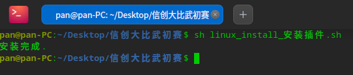
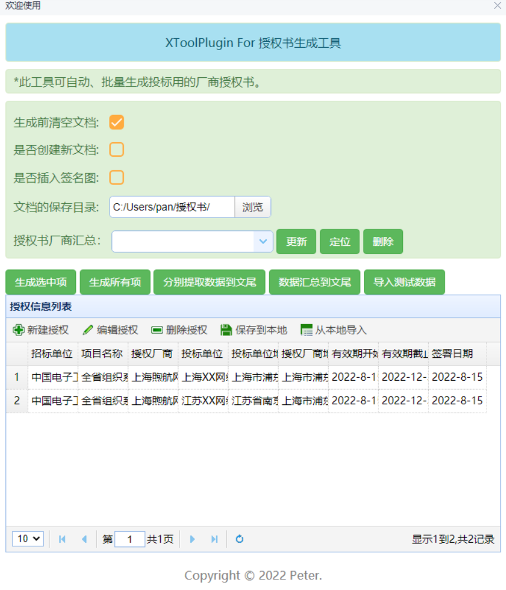
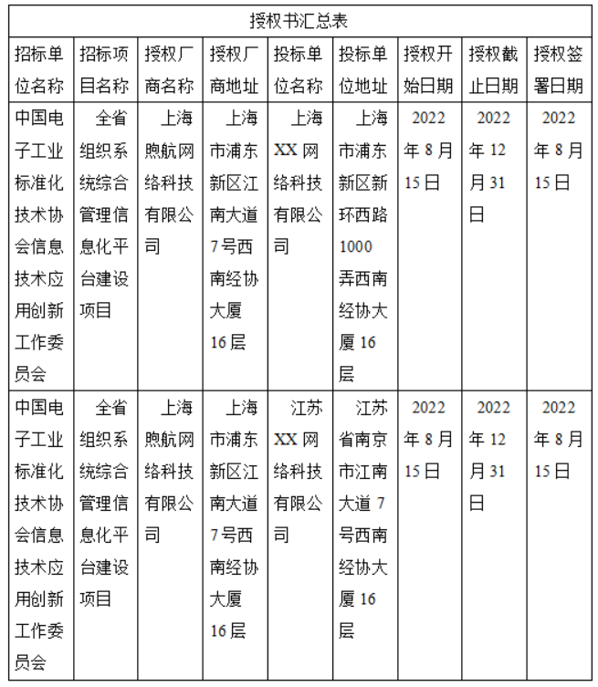
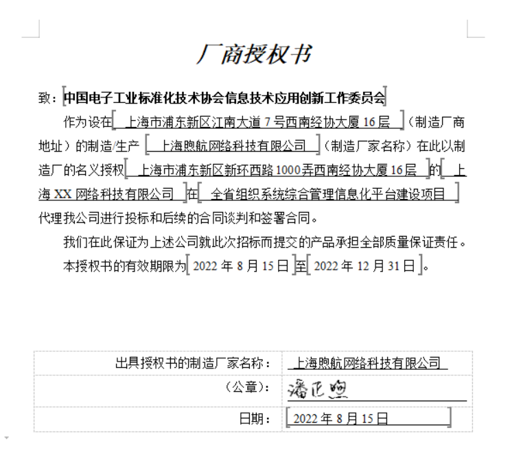
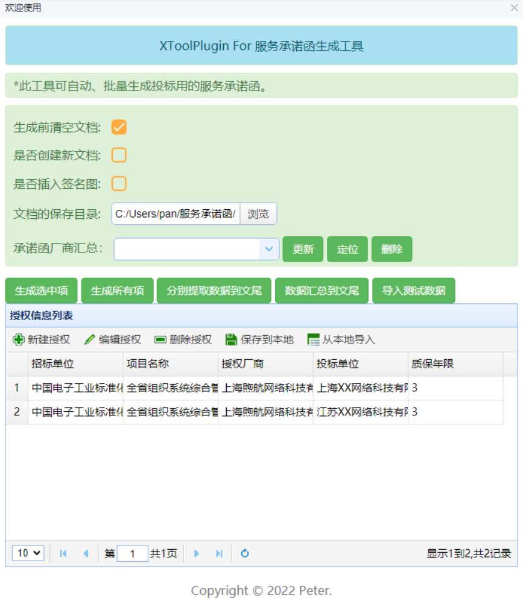
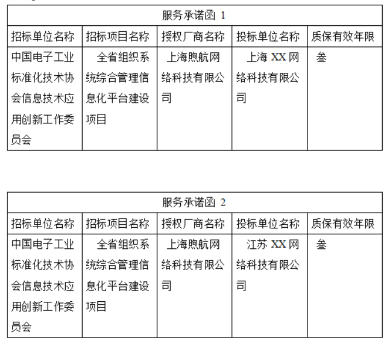
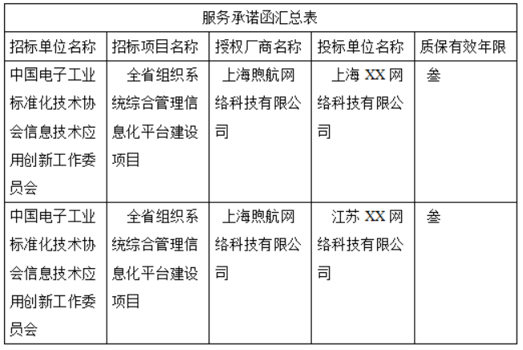
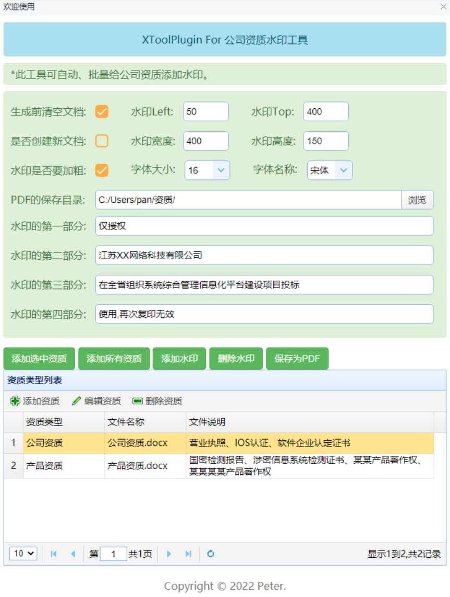
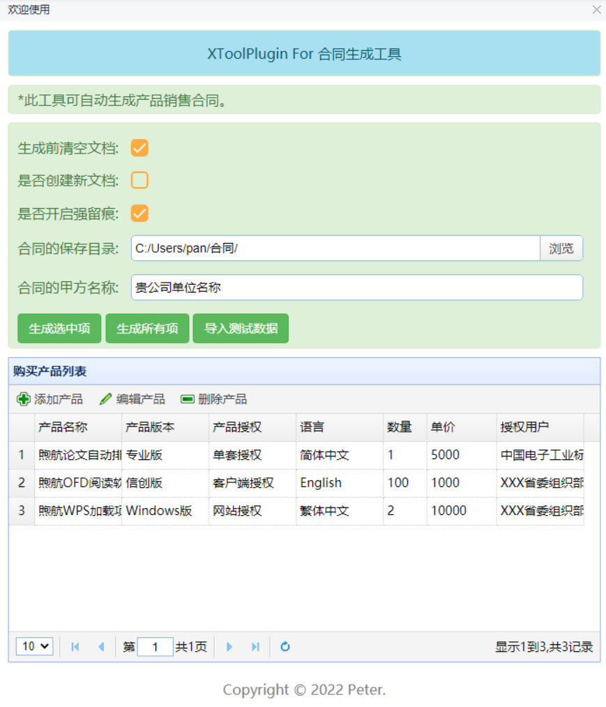
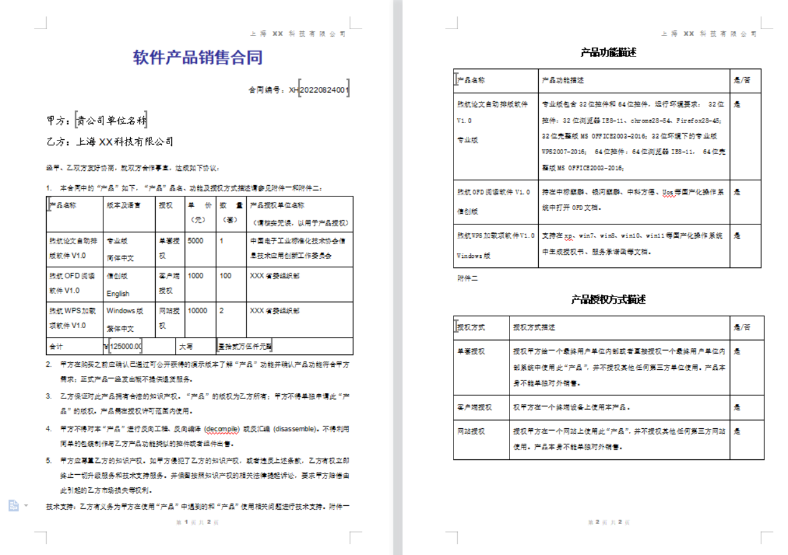

**XToolPlugin**

**编制：潘正煦**

**peter88@aliyun.com**

**日期：2022.08**

更新日志

| 序号 | 版本   | 时间       | 内容               |
|------|--------|------------|--------------------|
| 1    | V1.0.0 | 2022年08月 | 正式发布第一个版本 |

# 前言

目前WPS已支持通过js调用就可实现对文档的控制，而且是跨平台的，Window和Linux都可以支持，对于有JS基础的朋友，能结合自己的工作需要，实现自己的WPS加载项，提高自己的工作效率。让我们的工作更轻松、更愉快。为“Better Life”而“Code”,实现“CODE FOR BETTER”。

我的工作中有时候需要给合作伙伴发投标用的“厂商授权书”和“服务承诺函”，投标无小事，每次做这个都得小心意义，避免因为错误导致废标的事情发生，所以一直希望有一个工具能够输入相关信息后就可以自动生成“厂商授权书”和“服务承诺函”，这样效率又高，又能避免出错。

参加投标时往往还需要发公司的一些资质，根据公司管理规定，对于发出去的资质需要加上水印，以前的做法是根据项目需要，手动删除不需要的资质，然后替换相关内容，然后再手动另存为PDF。处理起来相对繁琐，因此也希望有一个工具能够快速生成加上水印后的PDF格式的资质文件。

投标成功后就需要签订合同了，这个时候需要给客户发合同模板。公司有不同的产品，每种产品有不同的授权体系，不同的授权也对应不同的价格。传统的做法是，根据购买的不同的产品，手动复制粘贴产品名称、功能描述、授权描述、产品版本等内容到合同中，所以如果有一个工具能够自动生成合同模板也将大大提高我们的工作效率。

基于上述工作中的需要，结合此次“2022 Code for Better \_ Hackathon ”的主题。我为此次参赛作品规划了四大功能：一、生成授权书；二、生成服务承诺函；三、生成水印资质；四、生成产品合同。完成这四大功能后，考虑到我们看电影有时候有彩蛋，Edge浏览器地址栏输入“edge://surf/”也有彩蛋，因为也有了给此次参赛作品设计彩蛋的想法。在抖音上看到了我们小时候玩过的“警察抓小偷”的游戏，于是便利用wps的光标改变事件实现了这个设想。

此次参赛作品主要应用了以下技术点：

1.  书签的动态创建、读值、赋值、定位、与页面下拉框的联动等。
2.  表格的动态创建、动态插入行、单元格的合并、赋值等。
3.  文本的动态添加，并能控制文本的字体、大小、加粗、下划线、倾斜、对齐方式、大纲级别、段前间距、段后间距、行距格式等。
4.  文本框的动态创建，以及设置文本框的字体大小、字体名称、高度、宽度、位置等。
5.  图片的插入、图形填充色的修改等。
6.  强制留痕的开启和关闭、痕迹的接受与拒绝。
7.  RibbonUI中元素的动态改变。
8.  文档的允许编辑与只读控制。
9.  结构化数据的提取、汇总。
10. 文档的新建、清空、合并、转PDF等。
11. WindowSelectionChange、WindowBeforeRightClick、DocumentChange等事件的利用。

# 安装步骤

本产品基于WPS加载项的解决方案来开发的，仅支持WPS。WPS的版本可以是专业版，也可以是个人版。既可以支持Window操作系统，也可以支持国产化操作系统。

## 环境要求

| 操作系统   | WPS支持的Windows操作系统、国产化操作系统都可以       |
|------------|------------------------------------------------------|
| Office     | 官网上最新的WPS个人版或WPS专业版                     |
| 电脑分辨率 | 建议1920\*1080及以上，分辨率过低界面排版可能会不一致 |

本产品对于WPS官方提供的部署方式：jsplugins.xml模式和publish.xml模式都可以支持，具体做法请参考官方文档。本教程提供另外一种对普通用户也能直接使用的方案。

安装后打开任意Word文档都可以看到如下加载项。

## 国产操作系统

在解压后的文件夹中，点击右键，并在右键菜单中点击“在终端中打开”。

在终端中输入命令： linux_install_安装插件.sh 即可完成插件的安装。

## Windows操作系统

在解压后的文件夹中，找到“windows_install_安装插件.bat”，直接双击该文件即可完成插件的安装。

# 产品介绍

## 生成授权书

1.  
2.  
3.  
    1.  
        1.  **界面截图**

1.  **功能介绍**

【生成前清空文档】：如果不勾选【是否创建新文档】该选项生效，勾选后则生成前自动清空文档。

【是否创建新文档】：如果勾选则新建一个空白文档来生成，如果不勾选则直接在当前文档中生成。

【是否插入签名图片】：如果勾选则在生成好后的授权书中的签名位置插入签名。

【文档的保存路径】：设置文档生成后自动保存的目录。

【授权书厂商汇总】：生成文档后，自动获取文档中的所有授权书并显示在下拉列表中，可以定位或删除。当光标点击到文档中书签时，此处的下拉列表会自动选中对应的授权书。

【更新】：重新读取文档中的所有授权书到下拉列表中。

【定位】：光标自动跳转到下拉列表中选中的授权书。

【删除】：删除下拉列表中选中的授权书。

【生成选中项】：仅生成授权信息列表中选中的授权。

【生成所有项】：生成授权信息列表中添加的所有授权。

【分别提取数据到文尾】：提取授权书到文尾，一个授权书一个表格。招投标无小事，可以用于校对相关数据是否准确。效果如下：

【数据汇总到文尾】：提取授权书到文尾，所有授权书一个表格。招投标无小事，可以用于校对相关数据是否准确。效果如下：

【导入测试数据】：快速导入用于测试的数据，查看生成授权书的效果。此按钮可以通过加载项【数据维护】按钮设置IsSHowImportTestDataBtn为false，隐藏按钮。

【新建授权】：添加新的授权书，在新建页面输入相关信息即可。

该页面中的【保存为默认值】按钮可以将信息保存，下次新建时刻点击【载入默认值】按钮直接导入。对于同一个项目就只需要输入不同的投标单位名称和投标单位地址即可。

【编辑授权】：编辑授权书列表中已新建的授权书，在编辑页面编辑相关信息即可。

【删除授权】：删除授权书列表中已新建的授权书。

【保存到授权】：将授权书列表中已新建的授权书保存到本地，下次可以通过【从本地导入】按钮直接导入。

【从本地导入】：导入保存到本地的数据。

1.  **生成效果**

## 生成服务承诺函

1.  
    1.  **界面截图**

1.  **功能介绍**

【生成前清空文档】：如果不勾选【是否创建新文档】该选项生效，勾选后则生成前自动清空文档。

【是否创建新文档】：如果勾选则新建一个空白文档来生成，如果不勾选则直接在当前文档中生成。

【是否插入签名图片】：如果勾选则在生成好后的授权书中的签名位置插入签名。

【文档的保存路径】：设置文档生成后自动保存的目录。

【授权书厂商汇总】：生成文档后，自动获取文档中的所有服务承诺函并显示在下拉列表中，可以定位或删除。当光标点击到文档中书签时，此处的下拉列表会自动选中对应的服务承诺函。

【更新】：重新读取文档中的所有服务承诺函到下拉列表中。

【定位】：光标自动跳转到下拉列表中选中的服务承诺函。

【删除】：删除下拉列表中选中的服务承诺函。

【生成选中项】：仅生成授权信息列表中选中的服务承诺函。

【生成所有项】：生成授权信息列表中添加的所有服务承诺函。

【分别提取数据到文尾】：提取服务承诺函到文尾，一个服务承诺函一个表格。招投标无小事，可以用于校对相关数据是否准确。效果如下：

【数据汇总到文尾】：提取服务承诺函到文尾，所有服务承诺函一个表格。招投标无小事，可以用于校对相关数据是否准确。效果如下：

【导入测试数据】：快速导入用于测试的数据，查看生成服务承诺函的效果。此按钮可以通过加载项【数据维护】按钮设置IsSHowImportTestDataBtn为false，隐藏按钮。

【新建授权】：添加新的授权书，在新建页面输入相关信息即可。

该页面中的【保存为默认值】按钮可以将信息保存，下次新建时刻点击【载入默认值】按钮直接导入。对于同一个项目就只需要输入不同的投标单位名称即可。

【编辑授权】：编辑授权书列表中已新建的服务承诺函，在编辑页面编辑相关信息即可。

【删除授权】：删除授权书列表中已新建的服务承诺函。

【保存到授权】：将授权书列表中已新建的服务承诺函保存到本地，下次可以通过【从本地导入】按钮直接导入。

【从本地导入】：导入保存到本地的数据。

1.  **生成效果**

## 生成水印资质

1.  
    1.  **界面截图**

1.  **功能介绍**

【生成前清空文档】：如果不勾选【是否创建新文档】该选项生效，勾选后则生成前自动清空文档。

【是否创建新文档】：如果勾选则新建一个空白文档来生成，如果不勾选则直接在当前文档中生成。

【水印是否要加粗】：字体是否加粗。

【PDF的保存目录】：添加水印后会自动转PDF，设置PDF文档生成后自动保存的目录。

【水印Left】：水印文本框的左边距。

【水印Top】：水印文本框的上边距。

【水印宽度】：水印文本框的宽度。

【水印高度】：水印文本框的高度。

【字体大小】：水印字体的大小。

【字体名称】：水印字体的名称。

【添加选中资质】：仅生成资质授权列表中选中的授权。

【添加所有资质】：生成资质授权列表中添加的所有授权。

【添加水印】：对每一页自动添加水印，该按钮仅添加水印，用于只需要添加水印的场景。

【删除水印】：删除每一页中的水印。

【保存为PDF】：将文档另存为PDF，该按钮仅另存为PDF，用于只需要另存为PDF的场景。

【添加资质】：在新建资质页面输入相关信息即可。

【编辑资质】：在编辑资质页面修改相关信息。

【删除资质】：删除资质授权列表中选中的资质。

## 生成效果

## 生成合同

1.  **界面截图**

1.  **功能介绍**

【生成前清空文档】：如果不勾选【是否创建新文档】该选项生效，勾选后则生成前自动清空文档。

【是否创建新文档】：如果勾选则新建一个空白文档来生成，如果不勾选则直接在当前文档中生成。

【是否强制留痕】：合同生成好后自动启动强制留痕，这样别人修改后可以看到痕迹，快速知道别人修改了那些内容。

【合同的保存路径】：设置文档生成后自动保存的目录。

【合同的甲方名称】：合同中的甲方单位名称。

【生成选中项】：仅生成购买产品列表中选中的产品。

【生成所有项】：生成购买产品列表中添加的所有产品。

【导入测试数据】：快速导入用于测试的数据，查看生成合同的效果。此按钮可以通过加载项【数据维护】按钮设置IsSHowImportTestDataBtn为false，隐藏按钮。

【新建产品】：添加新的授权书，在新建页面选择相关信息即可。

此页面中的数据可以通过【数据维护】模块维护。每个产品可以对应不同的产品版本、产品授权、产品语言、产品单价等。在产品下拉列表中选择产品即可实现联动，自动出现关联的数据。

【编辑产品】：编辑购买产品列表中已新建的产品，在编辑页面编辑相关信息即可。

【删除产品】：删除购买产品列表中已新建的产品。

1.  **生成效果**

## 数据维护

1.  **界面截图**

1.  **功能介绍**

【还原】：此操作将会把数据还原为出厂默认数据。

【重置】：此操作将会把数据重置为最近一次保存的的数据。

【保存】：保存数据到本地，并刷新已经打开的任务窗格使数据生效。

在[Pdoduct]节点下的各个孙节点点击节点前面的图标将显示菜单。如下图：

【复制】：自动复制该节点并插入到当前节点，通过该功能可快速新建节点，复制后修改需要改的内容即可。

【移除】：删除当前节点。

【插入产品分类】：按程序中的模板插入一个节点到当前节点，通过该功能可快速新建节点，插入后修改需要改的内容即可。

-   \*在蓝色字段的内容上点击鼠标左键，状态栏会提示该字段的相关信息。

## 彩蛋

### 界面截图

### 功能介绍

【简单模式】：开启后更容易，关闭后会难一些。

【开始游戏】：打开游戏的文档，并自动重置游戏的数据。

【重新开始】：重置游戏的数据。

-   \*点击红色圆圈相邻的圆圈就可以让红色圆圈走动。

## 其他

1.  **是否显示书签符**

这是一个状态开关按钮，点击后可以切换书签标记的显示状态。

1.  **修订功能**

【开启强制留痕】：开启此功能后，文档修改了将会留下痕迹。

【关闭强制留痕】：关闭留痕后，对文档的修改不会留下痕迹。

【接受所有修订】：接受对文档的所有修改。

【拒绝所有修订】：拒绝对文档的所有修改。

-   \*以上功能可以用于通过加载项生成的合同，也可以用于其他文档。

# 商标和权利声明

## 关于本软件的使用申明

本软件可免费使用，任何人可以随意修改、分发、复制。

## 关于本文提到的商标声明

本文提到的WORD、WPS等可能涉及其他公司商标，所有权利归属其被注册公司。在本文中出现只是为了技术阐述目的，并不意味着本公司拥有，或者被授权使用这些商标。

## 关于EasyUI的声明

本软件中使用了EasyUI 免费版本,EasyUI团队允许任何团队或组织在免费的项目中使用该版本，该软件的所有权归EasyUI团队所有。

## 关于JSON Editor 的声明

本软件中使用了开源的JSON Editor用于数据维护模块 ,开源协议为《Apache 协议 2.0》。
