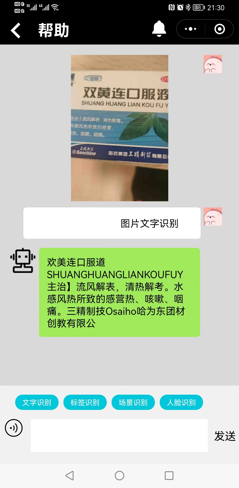

# 启明瞳——开始盲人新视界

## 作品介绍
### 说明
启明瞳和助助盲系统依托智能手机通过GPS北斗定位导航、人工智能（TensorFlow 的图像、文字、人脸识别、颜色识别等）、志愿者和由肢体残疾人担任的视频客服三种形式从软件、硬件、服务等三个维度真正解决盲人出行识图等相关问题。
### 应用场景
1. 通过启明瞳APP或者小程序借助AI技术和志愿者来帮助盲人看清楚视界，盲人可以在读屏软件支持使用启明瞳APP或者小程序拍照识别，基于TensorFlow的后端AI识别会将识别结果播报出来给盲人听。
2. 志愿者可以关注 我能帮帮忙 微信公共账号，成为志愿者，盲人通过启明瞳APP或者小程序发起的求助，志愿者能够远程帮助识别。

## 安装说明
  盲人使用智能手机需要 在手机设置 找到无障碍配置开启 屏幕阅读的功能更
[开启屏幕阅读（读屏软件）的百科教程](https://jingyan.baidu.com/article/48206aeac78044606ad6b39e.html)
- - -
### 启明瞳APP 
[最新版启明APP](./files/qmt_android.apk)

[启明瞳稳定版APP应用宝下载链接](https://sj.qq.com/appdetail/cn.com.bemyeyes)
- - -

### 微信小程序使用教程：
### 1.盲人先关注  启明瞳服务号   可以收到相关志愿者通知，

### 2.盲人关注 启明瞳小程序 在读屏软件支持可以进行智能识别和求助志愿者。

## 功能简介
<!-- 请给出该应用的主要功能点 -->
参考PPT：
[项目ppt](./files/%E5%90%AF%E6%98%8E%E7%9E%B3%E8%A1%8C%E2%80%94%E2%80%94%E5%BC%80%E5%90%AF%E7%9B%B2%E4%BA%BA%E6%96%B0%E8%A7%86%E7%95%8C.pdf)

 启明瞳——开启盲人新视界是以微信小程序为依托，由团队全职的无障碍工程师进行全面的无障碍优化，为视障者和全国各地盲协搭建启明瞳小程序和启明瞳APP和启明行APP，为全国各地助残助盲志愿者协会搭建轻量志愿者服务号平台，志愿者只需要关注我能帮帮忙微信公共账号就可以轻松成为志愿者，志愿者不需要下载专门的APP就可以帮助盲人的解决问题。  在视障者一端要考虑视障者心里，首先通过AI技术解决视障者80%到90%的问题，剩余10%到20%的复杂问题在启明瞳行里面向发消息一样发给我们搭建的我能帮帮盲系统，由系统后台从关注志愿者协会的公众账号的志愿者随机抽取10个人发送通知消息，志愿者会收模板消息通知，哪位志愿者有空只需要用几秒钟来帮助盲人解答问题。

#### 启明瞳APP主界面（采用独特转适合盲人在读屏软件单手操作）

#### 启明瞳APP智能求助界面

#### 启明瞳APP视频求助界面

#### 启明瞳小程序

#### 启明瞳小程序识别界面

#### 志愿者 在我能帮帮忙 微信服务号收到的盲人求助界面

## 使用到的 Google 技术
- 安卓
- 小程序 TensorFlow.js
- 服务器端：TensorFlow
- 无障碍技术

## 团队
**启明团队**
- 目标：启明团队开启盲人新视界
- 团队负责人：周江南
- 团队成员：冯桂杰（聋人）、姜维（盲人）、丁利强、
- 团队联系   周江南微信：AceZhou20
- 手机号：18515399610
- 邮箱：zhoujiangnan@accessible.org.cn

---
