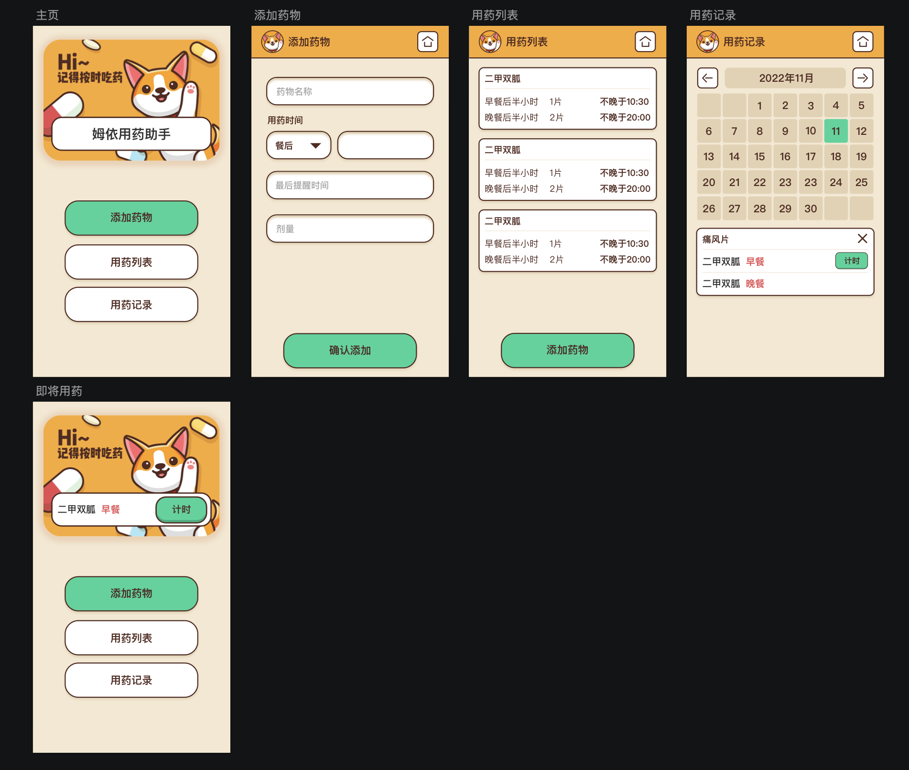

Mui 用药助手
==========

作为一名糖尿病患者，我发现市场上的用药助手和智能药盒可能都不是患者设计的，存在设计缺憾。主要表现在对用药时间的控制上：

1. 比如二甲双胍，要求餐后半小时服用。这里的半小时是指从吃第一口开始半小时，所以跟吃饭时间密切相关。而不是固定时间。
2. 比如尿酸药，最好早上吃，因为二小时后浓度最大，要辅以喝水促排尿。

大部分现成产品都只做了固定时间提醒而已，其实是不够的。

我希望在这个产品中，能够帮助患者计时，并且在超过特定时间后，再提醒一次。

体验
--------

[https://meathill-hackathon-2022.vercel.app/](https://meathill-hackathon-2022.vercel.app/)

技术选型
--------

* Vue3 + Pinia + Vue-Router
* TypeScript
* PWA

### Google 技术

* Chrome 浏览器
* PWA (Progressive Web Application)

### 潜在问题

* 存储使用 LocalStorage
    * 容量有限（5MB）
    * Service worker 无法直接使用 localStorage

开发
--------

### 基本需求

1. Node.js >= 16
2. pnpm >= 7
3. 支持 Service worker 的现代浏览器

### 环境配置

1. Clone this repo to `/path/to/good-patient`
2. Install dependencies via `pnpm i`
3. For development, run `pnpm run dev`, and open browser to `http://localhost:5173`
4. For production, run `pnpm run build`, then serve `dist` directory as a static web server

团队
--------

团队名称：[roudan.io](https://roudan.io/)

### 团队成员

* [Meathill](https://blog.meathill.com/) 主创+开发
    * 微信 wakabanga 
    * [邮箱](mailto:meathill@gmail.com)
    * [GitHub](https://github.com/meathill)
    * [微博](https://weibo.com/meathill)
* Eggeast 设计师

LICENSE
-------

[MIT](https://opensource.org/licenses/MIT)
